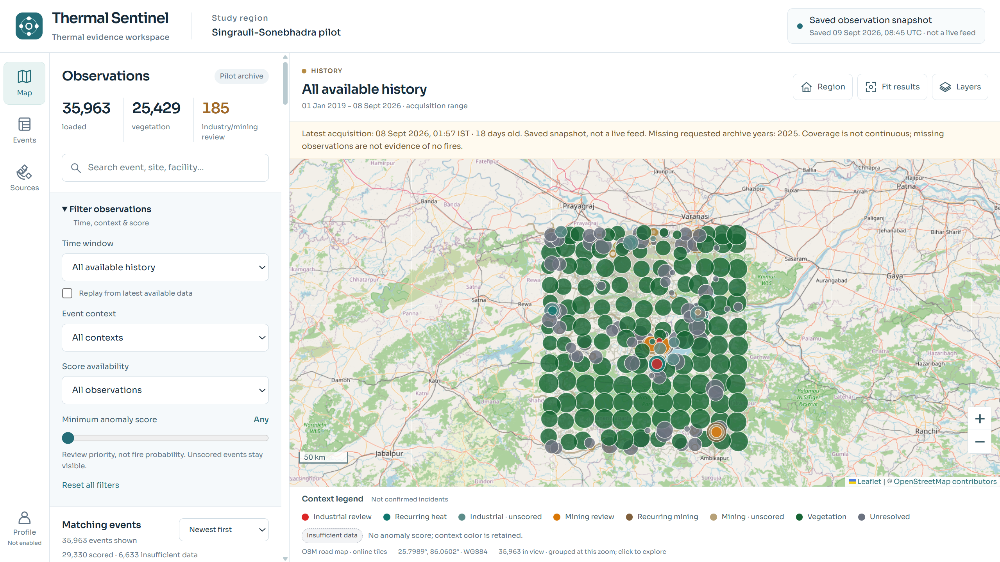
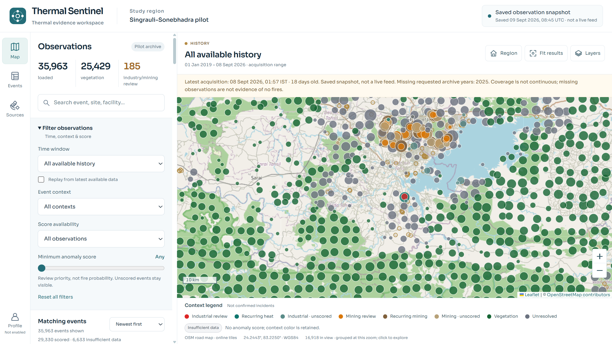
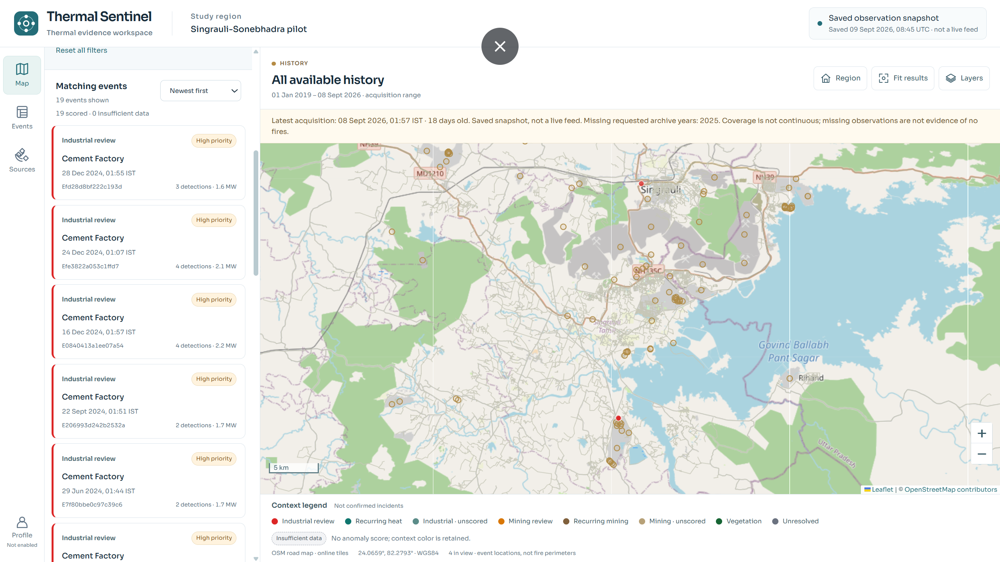
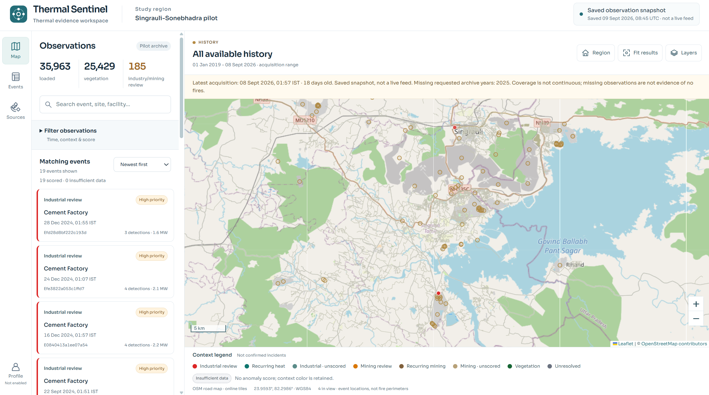
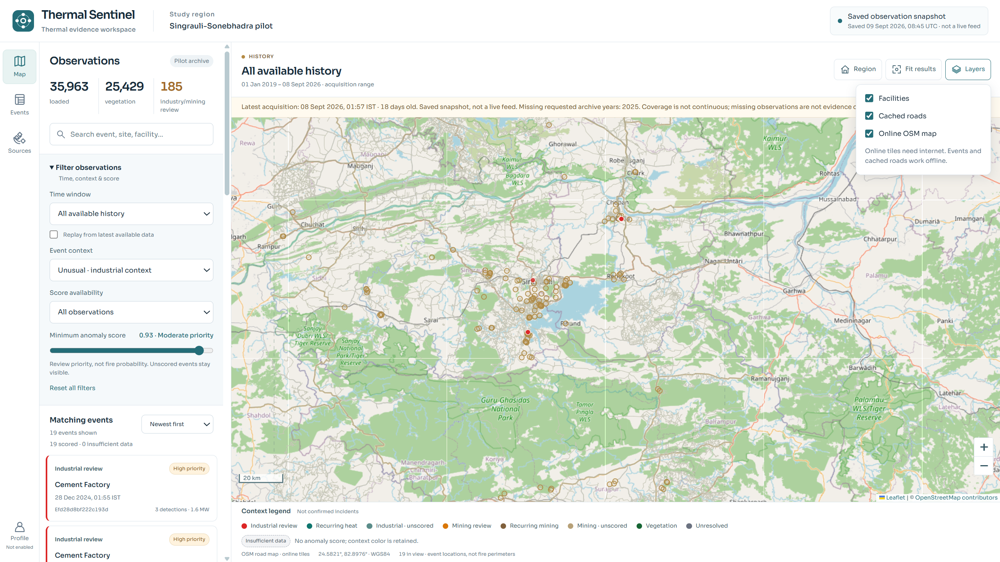
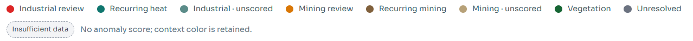
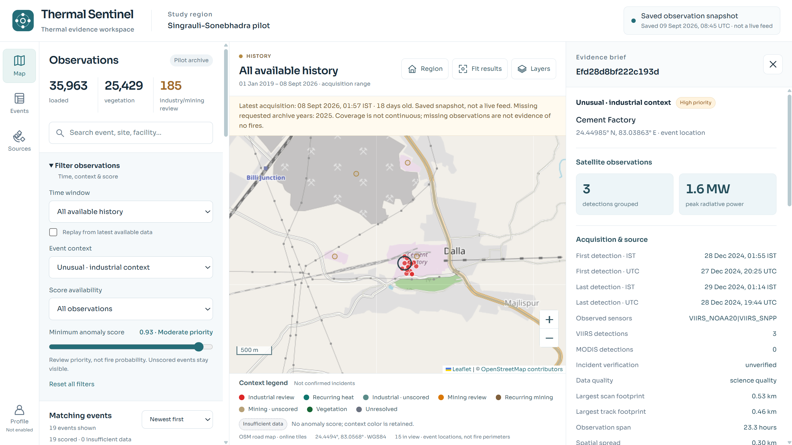
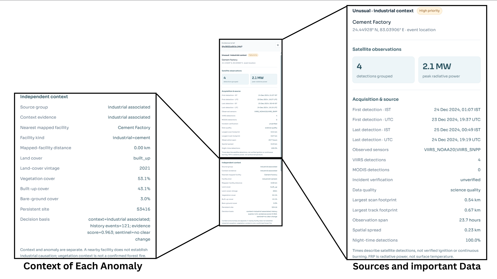
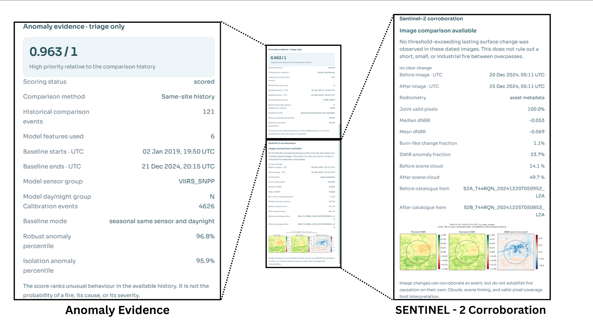
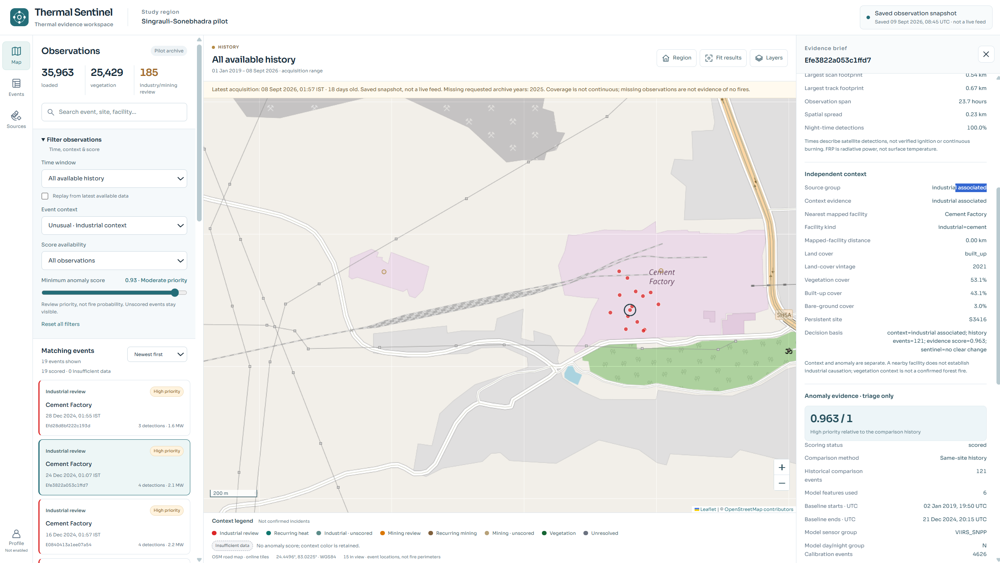

# Thermal Sentinel — SIH 26162

A map dashboard for reviewing satellite heat detections, industrial and
vegetation context, anomaly rankings, and available Sentinel-2 evidence in
**Singrauli–Sonebhadra**.

> Research screening only. An anomaly score is not a fire probability or a
> confirmed accident.

## Contents

- [Dashboard guide](#dashboard-guide)
- [Run locally in 3 steps](#run-locally-in-3-steps)
- [Internet and offline use](#do-i-need-internet)
- [Data coverage and dates](#which-dates-can-i-view)
- [Quick fixes](#quick-fixes)
- [Everyday commands](#everyday-commands)
- [Optional rebuild, packaging, and tests](#optional-commands)
- [More information](#more-information)

## Dashboard guide

Thermal Sentinel is organized around a map, a filterable observation list, and
an evidence panel. The screenshots below use the supplied saved snapshot, so
the values and dates shown are examples from the demo archive rather than live
measurements.

### Regional overview

The main map shows the full Singrauli-Sonebhadra study region. The summary
cards report how many observations are loaded and how they are categorized.
Use the map controls to change the viewport, fit the results, or open the
available map layers.



### Map exploration

Zooming into the map changes the spatial grouping and reveals the distribution
of observations around facilities, vegetation, and other mapped context. This
view is useful for moving from regional screening to a local area of interest.



### Matching events

The matching-events list turns the map results into selectable review cards.
Each card exposes the context label, priority, date, event identifier,
detection count, and radiative-power summary. Select a card to inspect its
evidence brief.



### Filtering observations

The filter panel narrows the results by time window, event context, score
availability, and minimum anomaly score. The score slider changes review
priority; it does not represent the probability of a fire. Unscored events
can remain visible when the other filters match.



### Map layers

The Layers menu controls contextual overlays independently from the event
results. Facilities and cached roads remain available offline; the online
OpenStreetMap layer needs an internet connection.



### Context legend

The legend explains the colors used for industrial review, recurring heat,
mining review, vegetation, unresolved observations, and insufficient data.
These labels describe screening context and data availability, not confirmed
incidents.



### Evidence brief

Selecting an event opens the evidence brief beside the map. It summarizes the
event location, grouped satellite detections, peak radiative power, acquisition
times, observed sensors, data quality, and spatial or temporal spread.



### Independent context

The context section shows supporting information such as the nearest mapped
facility, facility type, land-cover composition, persistent-site identifier,
and the decision basis. Context helps prioritize review but does not prove that
a facility caused an anomaly or that vegetation indicates a fire.



### Anomaly score and corroboration

The evidence panel separates anomaly ranking from satellite corroboration. The
anomaly score ranks unusual behavior against the available comparison history.
Sentinel-2 imagery can show whether a dated surface change was observed, but
clouds, revisit timing, and valid-pixel coverage limit interpretation.



The complete event view brings the map, event list, independent context, and
anomaly evidence together for a single review workflow.



## Run locally in 3 steps

You need **Python 3.12** and a modern browser. Viewing the supplied results
does **not** require `pip install`, Node.js, a database, API keys, or a GPU.

Check your Python version first:

```console
python --version
```

It should report `Python 3.12.x`. If Windows cannot find `python`, try
`py -3.12 --version` and use `py -3.12` instead of `python` below. On macOS/Linux,
try `python3 --version` and use `python3` if it reports 3.12.x. Install Python
3.12 first if none is available; reopen your terminal after installation.

### 1. Get the project

Choose **one** method. With Git installed:

```console
git clone --branch main https://github.com/mynkz3/heat-waves.git
cd heat-waves
```

Or, without Git, put the supplied `heat-waves-source.zip` in a new working
folder, open a terminal there, and run:

```console
python -m zipfile -e heat-waves-source.zip heat-waves
cd heat-waves
```

**Run every remaining command from this `heat-waves` folder**, where `app.py`
lives. If you already have the project, skip cloning/extracting it again.

### 2. Add the data package

Get **`heat-waves-data.zip` from the project maintainer**. It is supplied
separately and is **not included in the Git repository**.

Place the data ZIP **one folder above** the project folder. From inside
`heat-waves`, extract it with:

```console
python -m zipfile -e ../heat-waves-data.zip .
```

Alternatively, extract it manually alongside `app.py`. The result must be:

```text
heat-waves/
├── app.py
├── config.json
├── backend/
├── frontend/
├── data/
└── outputs/
    └── site/
        └── index.html
```

Do not leave `data/` and `outputs/` nested inside a `heat-waves-data/` folder.
Use the source and data packages distributed together.

### 3. Start the dashboard

```console
python app.py check --mode view
python app.py serve --open
```

The second command starts the server and opens your browser. If it does not
open automatically, visit **http://127.0.0.1:8000/**.

Keep the terminal running. Press **Ctrl+C** to stop.
Next time, open a terminal in this folder and run only
`python app.py serve --open`.

**Do not double-click `index.html`.** Always use the localhost address.
Starting the dashboard does not train models or download new datasets.

## Do I need internet?

- **Online:** the map can display detailed OpenStreetMap street tiles.
- **Offline:** supplied results, filters, cached roads, and saved evidence
  remain available. Cached roads are not a complete offline street basemap.
- **No automatic updates:** connecting to the internet does not refresh
  thermal detections or retrain models.

## Which dates can I view?

The supplied snapshot has **35,963 observation episodes**, not 35,963
confirmed fires. It covers **2019–2024** and a short September 2026 snapshot.
**2025 is missing**; the latest observation is **7 September 2026, 20:27 UTC**.

Use **All time** or historical dates for the demo. Latest/week/month filters
may be empty because this is a saved dataset, not a live feed.

## Quick fixes

| Problem | What to do |
| --- | --- |
| Missing datasets or results | Extract the matching data ZIP beside `app.py`. A source-only clone is not enough. |
| “Prepared site missing” | If saved results are present, run `python app.py prepare`, then start the server again. This does not retrain models. |
| Port 8000 is busy | Run `python app.py serve --port 8080 --open`. |
| Blank page or blocked OSM tiles | Use the localhost URL, reload, and check your internet/privacy settings. Cached roads still work offline. |
| Need to verify downloaded files | Run `python app.py check --mode view --deep` to check supplied manifests and result consistency. |

## Everyday commands

Choose the command for your task; **do not run every row in sequence**.

| Task | Command |
| --- | --- |
| Start and open the browser | `python app.py serve --open` |
| Start without opening a browser | `python app.py serve` |
| Stop the server | Press `Ctrl+C` in its terminal |
| Use another port | `python app.py serve --port 8080 --open` |
| Check supplied files | `python app.py check --mode view` |
| Verify supplied hashes and saved results | `python app.py check --mode view --deep` |
| Regenerate the map from saved results | `python app.py prepare` |
| Show all commands | `python app.py --help` |
| Show options for one command | `python app.py serve --help` (also works for `prepare`, `check`, `rebuild`, `package`) |

After `prepare`, start the server again or reload the open dashboard.
It regenerates browser assets only; it does not run the models.

Every command accepts a project-relative `--config` **after** the command:

```console
python app.py serve --config config.json --host 127.0.0.1 --port 8000 --open
```

Keep the host at `127.0.0.1` for local use. Changing it can expose the server
to other computers.

## Optional commands

**Skip these if you only want to view the supplied dashboard.**

<details>
<summary>Rebuild the analysis from local datasets</summary>

Requires the complete data package and scientific dependencies. Choose your
operating system; virtual-environment activation is not needed.

Windows PowerShell:

```powershell
python -m venv .venv
.\.venv\Scripts\python.exe -m pip install -r requirements.txt
.\.venv\Scripts\python.exe app.py check --mode rebuild --deep
.\.venv\Scripts\python.exe app.py rebuild
```

macOS/Linux:

```sh
python3 -m venv .venv
.venv/bin/python -m pip install -r requirements.txt
.venv/bin/python app.py check --mode rebuild --deep
.venv/bin/python app.py rebuild
```

Dependency installation needs internet unless you have a local wheel cache.
The rebuild itself uses local datasets, rejects new downloads, and writes
to a new `runs/rebuild-.../` folder. **It does not replace the dashboard.**
Review the printed comparison and run manifest there first.

To run another rebuild and replace the dashboard only after validation,
stop the running server, then explicitly choose the publish command:

```powershell
# Windows PowerShell
.\.venv\Scripts\python.exe app.py rebuild --publish
```

```sh
# macOS/Linux
.venv/bin/python app.py rebuild --publish
```

The old outputs are retained under the new run's `previous_outputs/`.
Allow disk space for both. Restart with `python app.py serve --open`.
Rebuilding can take substantially longer than opening saved results.

</details>

<details>
<summary>Run the prepared dashboard with Docker instead of Python</summary>

Install Docker with Compose first. Extract the source and data packages;
`outputs/site/index.html` must already exist. Stop any Python server using
port 8000 before starting this alternative.

```console
docker compose up --build
```

Open **http://127.0.0.1:8000/**. Press `Ctrl+C` to stop, then remove the stopped
container with:

```console
docker compose down
```

The first build needs internet for the Python image. Docker serves prepared
results only; it does not train models or download datasets. Prepare/rebuild
on the host if needed. Docker configuration has **not been runtime-tested**
in the development environment.

</details>

<details>
<summary>Create source and data ZIPs to share</summary>

Run these only on a project that already contains the datasets and saved
results. If browser assets are missing, run `python app.py prepare` first.

```console
python app.py package --kind all
```

This creates `dist/heat-waves-source.zip` and `dist/heat-waves-data.zip`, with
file-hash manifests. Give both ZIPs to the recipient. It does not upload them.

To regenerate just one package, choose one command:

```console
python app.py package --kind source
python app.py package --kind data
```

Source-only packaging needs no datasets. After intentionally changing a
delivered package, its old manifest may no longer match; create matching new
packages instead of ignoring integrity errors.

</details>

<details>
<summary>Developer tests and presentation figures</summary>

Install the virtual environment and dependencies shown in the rebuild
section first. Run Python tests:

```powershell
# Windows PowerShell
.\.venv\Scripts\python.exe -m unittest discover
```

```sh
# macOS/Linux
.venv/bin/python -m unittest discover
```

With Node.js installed, run the JavaScript tests:

```console
node --test tests/javascript/test_viewer.js tests/javascript/test_web_viewer.js
```

Browser integration tests additionally need a supported Chrome/Chromium/Edge
installation. To generate presentation figures from saved results:

```powershell
# Windows PowerShell
.\.venv\Scripts\python.exe -m scripts.make_ppt_figures
```

```sh
# macOS/Linux
.venv/bin/python -m scripts.make_ppt_figures
```

The figure command prints its output location. There is no `npm install`
or frontend build step. After editing `frontend/`, run `python app.py prepare`
and reload the dashboard.

</details>

## More information

- [Deployment and developer guide](docs/DEPLOYMENT.md): folder layout and
  detailed operational notes.
- [Data sources and limitations](docs/DATA_SOURCES.md): provenance, coverage,
  score interpretation, and attribution requirements.

This server is intended for localhost use, not unprotected public hosting.
